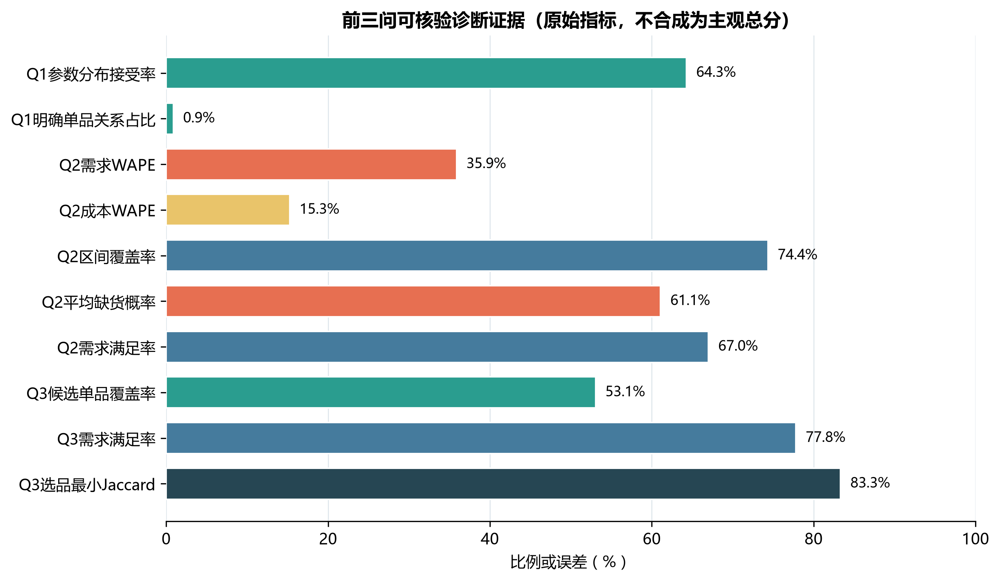
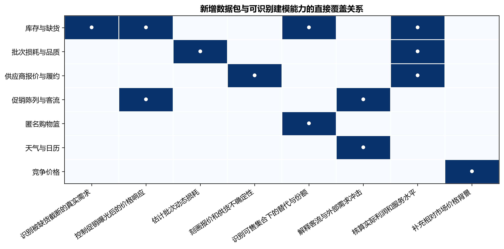
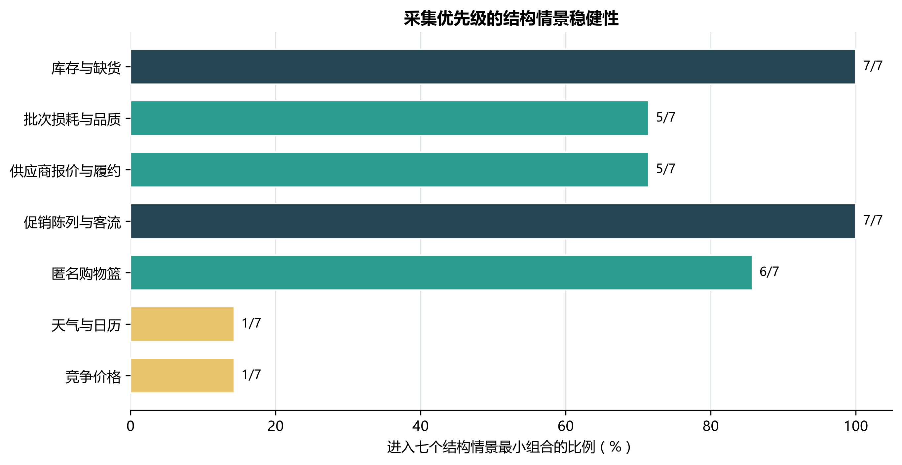

# 第四问：面向补货与定价改进的数据采集决策模型

> 建模方法：前三问证据审计、删失需求建模、逻辑能力覆盖、最小基数数据组合、结构情景灵敏度与增量回测-Pareto评价。

## 1 问题重述

### 1.1 问题背景

生鲜蔬菜经营具有采购时间早、货源和成本临近营业前才逐渐明确、商品寿命短、当日滞销损失高等特点。门店看到的销售流水只是已经完成的交易，并不等于顾客的全部需求：某单品提前售罄后，系统记录的零销量可能来自无货，而不是无人购买；临期折价、促销陈列和客流变化也会同时改变售价与销量，使历史价格和销量之间的统计关系难以直接解释为价格弹性。另一方面，题目给出的损耗率是近期盘点结果，无法描述不同批次、供应商、货龄和折价时点造成的损耗变化。上述信息缺口会逐层传递到需求分析、品类补货、单品选品和风险评价之中。

前三问已经利用现有四个附件完成了从规律识别到经营决策的闭环：第一问刻画品类与单品的分布、季节类型和关联关系；第二问预测未来一周品类需求与批发成本，并联合确定补货量和加价率；第三问在有限销售空间下把品类需求分解到单品，形成7月1日的选品、定价和订货方案。第四问不需要再建立一个与前三问平行的新经营优化器，而应审查前三问中哪些变量仍然不可观测、哪些参数只能回退或依赖管理设定，并给出能够直接修复这些缺口的数据采集方案。

近年的易腐品联合定价与库存研究强调，价格、订货、产品替代和随机需求之间存在相互依赖关系，分步估计可能造成决策偏差。Fang、Nguyen和Currie（2021）在多种可替代易腐商品的随机需求框架下研究了联合定价与库存决策，说明替代效应必须与价格和订货同时考虑[1]。Mani、Thomas和Bansal（2022）进一步利用交易与商品可得性数据同时估计替代和购物篮效应，其实证结果表明，只考虑替代而忽略购物篮放弃会明显降低样本外预测能力[2]。Castellano等（2022）则指出，易腐商品的组合、补货、陈列和容量配置具有联动关系，商品的展示数量与位置会影响需求[3]。这些研究共同说明：若要改进前三问，最关键的不是堆叠更复杂的算法，而是补齐库存可得性、购物篮、陈列、批次损耗和供应履约等决策所需的基础观测。

### 1.2 核心目标与边界

本问的核心目标是从前三问已经产生的真实结果出发，构建一套可执行、可验证、不过度依赖主观权重的数据采集决策方法。模型需要完成三项工作：第一，量化识别前三问的主要数据缺口；第二，在七类候选数据中找出能够完整支撑关键建模能力且不存在冗余的最小采集组合；第三，规定新增数据投入使用后的回测方法，使商超能够用实际预测、利润、服务和尾部风险改善量决定是否长期采集。

模型严格遵守以下边界：所有事前诊断数字来自第一至第三问的正式输出；未采集的新数据不假设概率分布、误差缩减比例或采集成本；数据价值不通过AHP、TOPSIS、Sobol指数或主观加权总分给出；天气和竞争价格等扩展信息只有在核心运营数据闭环完成后才进入优先级讨论；涉及购物篮和客流的数据必须遵循匿名化和最小化采集原则。

### 1.3 子问题提炼

问题4-1：如何根据前三问结果定位真正的数据缺口？需要把第一问的分布回退与弱关系、第二问的需求和成本预测误差、价格响应识别、缺货与服务指标，以及第三问的单品份额敏感性统一整理为可追溯的诊断证据，避免仅凭经验罗列数据名称。

问题4-2：在没有真实采集成本和信息后验分布的情况下，如何确定采集组合？需要将每类数据与其能够直接识别的建模能力建立逻辑关系，以满足能力约束的数据包数量最少为目标进行组合优化，并通过“删去任一数据包后是否仍可行”检验组合是否存在冗余。

问题4-3：新增数据如何量化改善前三问？需要保持前三问的训练窗口、测试日期、优化边界和随机场景不变，只改变新增信息集，通过滚动回测比较需求WAPE、成本WAPE、区间校准、实际利润、需求满足率和尾部利润；各指标不强行合成为一个总分，而采用Pareto支配和实际净收益规则评价。

## 2 问题分析

### 2.1 总体分析

本问采用“结果反推数据、能力约束选集、试采集后回测”的数据驱动思路。首先读取前三问已经验证的JSON和CSV结果，把模型误差、参数识别状态、场景服务水平和灵敏度范围转化为数据缺口；然后将库存缺货、批次损耗、供应履约、促销陈列与客流、匿名购物篮、天气日历和竞争价格划分为七个独立数据包，明确字段、粒度、用途和隐私边界；随后以真实需求识别、价格响应、动态损耗、供应成本、单品替代、外部需求和实际决策验证七项能力为约束，枚举最小可行采集组合；最后通过七种结构情景检验数据包优先级是否依赖某一项需求设定，并设计新增数据后的同窗口增量回测方案。

整个过程不预测尚未发生的数据采集效果。事前阶段回答“缺少什么、为什么缺、最少需要哪些”；事后阶段才利用真实新增样本回答“误差下降多少、利润增加多少、是否值得持续投入”。这样既符合第四问提出意见与理由的任务性质，又与前三问的模型和结果形成闭环。

### 2.2 问题4-1分析

问题4-1分析。关键矛盾是附件数据能够反映成交、历史批发价和近期损耗，却不能完整反映顾客真实需求与经营过程。销售为零可能同时对应无需求、未上架或已售罄；价格变化可能来自正常调价、促销或临期折价；品类销量可以预测，但品类内单品份额会随可售集合和缺货替代改变。因此，若不先区分“算法误差”和“信息不可观测”，直接增加复杂预测模型只会把数据缺口隐藏在更多参数中。

解题时先从正式结果中提取三类证据：第一类为统计识别证据，如参数分布接受率、明确关系比例和价格响应置信区间；第二类为预测与校准证据，如需求WAPE、成本WAPE和80%区间实际覆盖率；第三类为决策稳定性证据，如缺货概率、需求满足率、单品份额扰动导致的利润与服务区间。各指标保留原始单位和源文件，不合成主观严重度总分。由此得到“指标异常或敏感-对应的潜在不可观测变量-所需新增字段”的追溯链。

核心步骤为：读取前三问正式输出 → 核对样本口径与数值关系 → 计算比例、极差和覆盖缺口 → 解释每项指标对应的数据限制 → 形成数据缺口表。前一步提供可核验事实，后一步只作与模型结构直接相关的解释，不把弱统计关系误写成因果结论。

### 2.3 问题4-2分析

问题4-2分析。关键矛盾是商超希望确定采集优先级，但题目没有提供采集成本、部署周期和新数据的统计分布。如果人为给七类数据设置0-1“信息质量”、经济价值或专家权重，再使用VOI、AHP或TOPSIS排序，所得名次主要反映假设而非现有证据。

为此，将采集问题抽象为逻辑能力覆盖问题。每类数据不是获得一个人为分数，而是提供若干可审计能力。例如，只有库存与缺货事件才能直接区分正常销售与缺货删失；价格响应需要库存可得性和促销陈列信息同时存在；单品替代需要库存状态与匿名购物篮同时存在；实际利润与服务验证需要库存、批次损耗和供应履约共同闭环。模型枚举七类数据的所有子集，找出满足全部核心能力且数据包数量最少的组合。

核心步骤为：定义候选数据包 → 定义能力与逻辑前置条件 → 枚举数据包子集 → 判断能力约束 → 保留最小基数组合 → 对每个入选包执行删一检验 → 在调整问题边界的七种情景中重复求解。该方法不声称每个数据包的采集成本相同；“最少数据包”仅表示最少部署模块数，真实经济成本必须等试点报价和运维成本出现后再评价。

### 2.4 问题4-3分析

问题4-3分析。关键矛盾是事前结构必要性不等于事后经济价值。某类数据理论上能够修复一个缺口，但在具体门店中可能样本变化小、采集质量差，或者带来的决策改善不足以覆盖部署成本。因此，最小覆盖组合只能用于制定试采集顺序，不能直接替代价值验证。

解决思路是在新增数据形成连续样本后进行严格增量回测。以当前前三问模型为基准模型，仅增加一个数据包或一个组合，保持训练窗口、验证日期、场景数量、风险权重和约束边界一致，重新估计需求、成本、价格响应、单品份额和损耗。将新旧模型在相同测试期的需求WAPE、成本WAPE、区间校准误差、实际利润、需求满足率和最差10%利润逐项比较。若一个数据方案在所有指标上不差且至少一项严格更优，则判定其Pareto支配另一个方案；只有获得真实采集成本后，才计算长期净收益。

流程图框架：前三问正式输出 → 指标与来源校验 → 数据缺口识别 → 数据包和能力映射 → 最小组合枚举 → 删一最小性判断 → 七情景灵敏度 → 制定分阶段采集计划 → 新数据试采集 → 同窗口增量回测 → Pareto筛选与实际净收益判断。

## 3 模型假设

### 3.1 假设一：前三问正式输出能够代表现有信息条件下的基准能力

假设内容：第一至第三问通过验证的结果文件被视为当前信息集下的基准模型输出，第四问不重新训练或替换前三问模型。合理性依据：前三问已分别完成输出一致性、约束、场景和灵敏度检验，且第四问的任务是说明新增数据如何帮助上述问题，而不是重新求解前三问。模型影响：该假设使所有诊断指标与已有论文保持同一口径，避免因更换算法造成的混杂；相应地，第四问的结论继承前三问的适用边界。

### 3.2 假设二：数据包与建模能力之间采用保守的直接作用关系

假设内容：仅当一类数据能够提供某项模型所缺少的直接观测或必要条件时，才记为覆盖该能力；仅能间接相关或需要额外未知假设的数据不记为覆盖。合理性依据：例如天气可能解释需求波动，但不能识别商品是否因缺货停止销售；竞争价格可以补充市场背景，但不能替代本店促销原因和陈列曝光记录。模型影响：该假设会使入选组合偏保守，但能避免用弱相关变量虚假替代核心运营数据，提高建议的可执行性与可审计性。

### 3.3 假设三：同一数据包内部字段由同一业务流程联合采集

假设内容：库存与缺货、批次损耗、供应履约等数据包分别视为一个部署模块，包内字段可以通过同一ERP、POS或验收流程形成完整事件链。合理性依据：库存期初、到货、销售和期末数量若来自不同且无法对账的系统，不能形成可靠库存平衡；将高度耦合的字段拆成多个评分项会人为增加模型维度。模型影响：优化目标中的“数据包数量”表示部署模块数，而非字段数或货币成本，便于确定最小系统组合，但最终投资决策仍需真实成本核算。

### 3.4 假设四：结构情景只改变业务能力边界，不改变数据观测事实

假设内容：灵敏度分析通过暂缓单品替代、供应端或批次损耗，以及强化天气或竞争价格等业务要求构造情景；同一数据包的字段定义和直接作用关系在不同情景中保持不变。合理性依据：这能把优先级变化归因于业务目标变化，而不是在每个情景中随意修改数据权重。模型影响：情景包含率可以解释为结构稳健性，而不是随机权重模拟结果。

### 3.5 假设五：新增数据后的价值必须通过同窗口样本外回测确认

假设内容：未采集数据不预设误差缩减比例、利润提升、后验方差或采集成本；实际价值只在新增数据形成样本后，通过相同测试窗口和优化边界进行增量回测。合理性依据：新数据的信息含量取决于缺货频率、促销变化、供应波动和记录质量，现有附件无法识别这些条件分布。模型影响：第四问能够给出可靠的采集组合和评价协议，但不会产生虚假的事前EVSI数值；经济净价值需在试点后补充。

## 4 符号说明

| 符号 | 含义 | 单位 |
| --- | --- | --- |
| $i,c,t$ | 单品、品类和时间索引 | - |
| $Y_{it}$ | 单品在时段$t$内观测到的成交销量 | kg |
| $D_{it}$ | 单品在时段$t$内的潜在真实需求 | kg |
| $A_{it}$ | 单品在时段$t$内的可售库存 | kg |
| $\delta_{it}$ | 库存充足指示变量，充足为1，发生缺货为0 | - |
| $W_{ibt}$ | 单品$i$的批次$b$在时段$t$内实际损耗量 | kg |
| $\lambda_{ibt}$ | 单品批次动态损耗率 | % |
| $J$ | 候选数据包集合 | - |
| $y_j$ | 是否采集数据包$j$，采集为1 | - |
| $M$ | 需要由新增数据支持的建模能力集合 | - |
| $R_m$ | 实现能力$m$所允许的最小数据包组合族 | - |
| $z_{mr}$ | 能力$m$的第$r$个可行组合是否被满足 | - |
| $K_s$ | 情景$s$要求具备的能力集合 | - |
| $E_j^D,E_j^C$ | 采用数据方案$j$后的需求与成本WAPE | % |
| $H_j$ | 80%预测区间覆盖率相对0.8的绝对偏差 | % |
| $P_j$ | 采用数据方案$j$后测试期实际经营利润 | 元 |
| $F_j$ | 采用数据方案$j$后的实际需求满足率 | % |
| $R_j$ | 采用数据方案$j$后的最差10%平均利润 | 元 |
| $V_j$ | 数据方案$j$相对基准模型的多指标改善向量 | - |
| $C_j$ | 数据方案$j$经试点确认的采集与维护成本 | 元 |

## 5 模型建立与求解

### 5.1 现有信息集与诊断模型

设题目四个附件构成当前信息集

$$
\mathcal X_t^{(0)}=\{\text{商品信息、销售流水、历史批发价格、近期损耗率}\}. \tag{1}
$$

前三问在信息集$\mathcal X_t^{(0)}$上分别产生分布与关系结果$M_1$、品类预测和优化结果$M_2$、单品选品与补货结果$M_3$。第四问不再拟合一个与其平行的预测模型，而是定义证据集合

$$
\mathcal G=\{g_1,g_2,\ldots,g_{13}\}, \tag{2}
$$

每个诊断证据均表示为

$$
g_k=(q_k,n_k,v_k,u_k,s_k,e_k), \tag{3}
$$

其中$q_k$为来源问题，$n_k$为指标名称，$v_k$为数值，$u_k$为单位，$s_k$为源文件，$e_k$为与数据缺口直接相关的解释。该结构保证每一个采集建议都能够回溯到前三问的实际输出，而非来自一般化经验。

对于比例、覆盖率和WAPE等指标，程序检查其有限性和合理取值区间；对于利润和补货极差，保留原始货币或重量单位，不与比例强行归一化。这样避免将不具可比性的指标相加形成一个缺乏经济含义的综合分数。

### 5.2 缺货删失下的真实需求模型

现有流水中的成交量满足

$$
Y_{it}=\min(D_{it},A_{it}). \tag{4}
$$

当整个观察时段库存充足时，$\delta_{it}=1$且$D_{it}=Y_{it}$；发生缺货时，$\delta_{it}=0$且只能确定$D_{it}\ge Y_{it}$。新增库存和缺货事件后，可用删失似然估计需求模型参数$\theta$：

$$
L(\theta)=\prod_{\delta_{it}=1}f_D(Y_{it}\mid X_{it};\theta)
\prod_{\delta_{it}=0}\left[1-F_D(Y_{it}\mid X_{it};\theta)\right]. \tag{5}
$$

式（5）中，非缺货记录对需求密度提供完整观测，缺货记录通过生存概率提供需求下界信息。它不要求人为假定“缺货使需求降低多少”，而是利用库存事件直接标记删失状态。修正后的实际需求满足率为

$$
FR=1-\frac{\sum_{i,t}(D_{it}-Y_{it})_+}{\sum_{i,t}D_{it}}. \tag{6}
$$

该指标可以替代仅依赖模拟场景的缺货解释，同时为第二问商誉成本和第三问服务优先目标提供可观测校准依据。需要强调的是，库存数据能够估计未满足数量，但将其折算为顾客长期价值仍属于管理评价，不能仅靠销量数据自动确定。

### 5.3 价格、损耗与单品关系的模型修正

加入促销、陈列、客流、天气和库存状态后，品类条件价格响应写为

$$
\ln D_{ct}=\alpha_c+\beta_c\ln P_{ct}+\boldsymbol\gamma_c^{\mathsf T}Z_t+\varepsilon_{ct}, \tag{7}
$$

其中$Z_t$包含促销类型、折价原因、陈列位置、分时客流、库存可得性、天气和日历变量。$\beta_c$表示控制已观测混杂后的条件价格响应。若商超在历史安全价格区间内对可比单品或可比日期实施小幅随机对照调价，则价格分配与未观测需求冲击独立，可进一步把$\beta_c$解释为局部因果效应；未实施对照时仍只作条件关联解释。

对单品$i$的批次$b$，利用库存平衡计算实际损耗：

$$
W_{ibt}=I_{ib,t}^{\mathrm{beg}}+Q_{ibt}-Y_{ibt}-I_{ib,t}^{\mathrm{end}}-T_{ibt}, \tag{8}
$$

$$
\lambda_{ibt}=\frac{W_{ibt}}{I_{ib,t}^{\mathrm{beg}}+Q_{ibt}}. \tag{9}
$$

其中$T_{ibt}$表示退货、调拨等非销售流出。由此可以进一步估计$\lambda_{ibt}=g(\text{货龄、供应商、验收等级、温湿度、折价时点})$，把静态近期损耗率替换为批次动态损耗率。

购物篮互补强度可用购买提升度表示：

$$
C_{ij}=\frac{P(i,j)}{P(i)P(j)}. \tag{10}
$$

结合库存可得状态后，单品$j$缺货对单品$i$的替代效应定义为

$$
S_{ij}=P(i\text{被购买}\mid j\text{缺货})-P(i\text{被购买}\mid j\text{有货}). \tag{11}
$$

两个条件概率需要在相似星期、时段、客流和促销状态下比较。只有当$S_{ij}>0$且置信区间不跨0时，才认为存在较明确的$j\rightarrow i$替代证据。第三问的单品需求因此改写为

$$
D_{it}=D_{c(i)t}\pi_{it}(A_t), \tag{12}
$$

其中$\pi_{it}(A_t)$是给定可售集合$A_t$后的份额，不再固定为近期与长期销量的单一加权结果。

### 5.4 数据包-建模能力覆盖模型

候选数据包集合$J$包含库存缺货、批次损耗、供应履约、促销陈列与客流、匿名购物篮、天气日历和竞争价格。核心能力集合$M$包含潜在需求、价格响应、动态损耗、供应成本、单品替代、外部需求和实际决策验证。

对能力$m$，设$R_m$为能够实现该能力的最小数据包组合族。例如：

- 潜在需求要求库存缺货数据；
- 价格响应要求库存缺货与促销陈列客流同时存在；
- 单品替代要求库存缺货与匿名购物篮同时存在；
- 实际决策验证要求库存缺货、批次损耗和供应履约同时存在；
- 外部需求冲击可由促销陈列客流或天气日历中的至少一类支持。

设$y_j\in\{0,1\}$表示是否采集数据包$j$。能力$m$被满足当且仅当至少存在一个$r\in R_m$，使其中全部数据包被选择：

$$
\exists r\in R_m,\quad \sum_{j\in r}y_j=|r|. \tag{13}
$$

在没有真实采集成本时，以部署模块数量最少为目标：

$$
\min\sum_{j\in J}y_j,
\quad
\text{s.t. 式（13）对所有 }m\in K_s\text{成立}. \tag{14}
$$

$K_s$为情景$s$要求的能力集合。由于只有7个数据包，程序直接遍历$2^7=128$个子集，按数据包数量从小到大检查能力逻辑。直接枚举能够返回全部最小解，不存在整数规划容差或局部最优问题，也比引入复杂求解器更便于审查。

对任一最小组合$Y_s^*$执行删一检验：

$$
\forall j\in Y_s^*,\quad Y_s^*\setminus\{j\}\text{不可行}. \tag{15}
$$

若式（15）成立，则该组合不仅基数最小，而且每个入选数据包都有明确的不可替代作用。

### 5.5 结构情景灵敏度模型

为检验排序是否只依赖“完整采集”这一种设定，构造七种结构情景：完整核心链路、强化外部预测、强化市场定价背景、暂缓替代识别、暂缓供应端扩展、暂缓批次损耗、只做需求识别试点。每个情景只改变$K_s$，数据包字段和能力关系保持不变。

设$N=7$为情景数，数据包$j$在情景最小解中的包含率定义为

$$
\rho_j=\frac{1}{N}\sum_{s=1}^N I(j\in Y_s^*). \tag{16}
$$

优先级不使用人为阈值，而依据逻辑状态确定：若数据包出现在全部情景最小解中，则为一级；若属于完整核心组合但在明确暂缓相应用途时可以移除，则为二级；若不属于核心组合、仅在强化扩展目标时入选，则为三级。

### 5.6 新增数据后的增量回测与Pareto评价

设$M_0$为当前模型，$M_j$为仅增加数据方案$j$后的模型。两者使用完全相同的滚动训练窗口、测试日期、场景集合和优化约束。需求与成本误差分别为

$$
E_j^D=\frac{\sum_t|D_t-\widehat D_t^{(j)}|}{\sum_tD_t},\qquad
E_j^C=\frac{\sum_t|C_t-\widehat C_t^{(j)}|}{\sum_tC_t}. \tag{17}
$$

区间校准误差定义为

$$
H_j=\left|\widehat{\mathrm{Cov}}_{80\%,j}-0.8\right|. \tag{18}
$$

结合实际利润$P_j$、实际需求满足率$F_j$和最差10%平均利润$R_j$，形成相对基准的改善向量

$$
V_j=(E_0^D-E_j^D,E_0^C-E_j^C,H_0-H_j,P_j-P_0,F_j-F_0,R_j-R_0). \tag{19}
$$

若$V_a$的所有分量均不小于$V_b$且至少一个分量严格更大，则数据方案$a$ Pareto支配$b$。获得实际采集和维护成本$C_j$后，再计算执行$N_j$个决策周期的净价值

$$
NV_j=N_j(P_j-P_0)-C_j. \tag{20}
$$

只有当方案在关键服务和风险指标上不劣、且$NV_j>0$时，才建议长期部署。式（19）和式（20）是试点后的评价协议，本问不使用未观测数据提前填入数值。

### 5.7 求解工具与步骤

模型使用Python实现。pandas读取第一至第三问的正式CSV和JSON文件，标准库itertools枚举128个数据包子集，matplotlib生成诊断证据、能力矩阵和情景包含率图。求解过程如下：

1. 读取8个前三问正式源文件，提取分布、关系、预测、价格响应、策略和灵敏度指标；
2. 形成13项诊断证据，检查数值有限性、单位和来源路径；
3. 定义7个数据包、8项直接能力映射及核心能力的联合前置条件；
4. 对每个结构情景，从空集到7元素集合按基数递增枚举，遇到首个可行基数后保留该基数的全部可行解；
5. 对每个最小解逐一删除入选数据包，验证是否破坏能力约束；
6. 统计各数据包在7种情景最小解中的包含次数，确定三级采集顺序；
7. 导出诊断表、数据目录、覆盖矩阵、最小组合、灵敏度、摘要和图形；
8. 由独立验证程序重新读取全部输出，执行来源、范围、可行性、最小性和图件完整性检查。

## 6 求解结果与结果分析

### 6.1 前三问数据缺口诊断结果

程序共形成13项可追溯诊断证据。第一问70个分析对象中45个参数分布通过检验，接受率为64.29%，其余25个使用KDE回退；2016对全单品关系中仅18对达到明确标准，占0.89%。该结果不意味着单品之间普遍不存在关系，而是说明日销量在零值、季节性和缺货状态混杂下，很难稳定识别替代与互补。

第二问的需求预测加权WAPE为35.88%，高于成本预测的15.28%；名义80%需求区间实际覆盖率为74.36%。六个品类中只有2个品类的价格响应置信区间完全小于0，茄类和辣椒类使用合并回退值。主策略平均模拟缺货概率为61.09%，期望需求满足率为67.01%。当商誉系数在既定灵敏度范围内变化时，周补货量由1937.58 kg增至2109.12 kg，极差达到171.54 kg。这些结果共同指向库存可得性、促销原因、客流和实际缺货损失观测不足。

第三问49个候选单品中仅26个具有第一问聚类覆盖，覆盖率为53.06%；325对有关系信息的候选组合中只有9对为明确关系。历史份额权重扰动使需求满足率在71.87%-82.84%之间变化，极差10.97个百分点；期望利润在-52.24元至356.31元之间变化，极差408.55元。基准方案最差10%平均利润为-423.21元。可见单品份额、可售集合和缺货替代是第三问最主要的数据风险，继续提高MILP求解精度不能解决输入不可观测问题。

图1保留各指标原始方向：WAPE和缺货概率越低越好，接受率、覆盖率、满足率和Jaccard越高越好。图中没有把不同含义的指标合成为一个“数据缺口总分”。

### 6.2 数据字段与作用关系

| 数据类别 | 主要字段 | 采集粒度 | 直接帮助 |
| --- | --- | --- | --- |
| 库存与缺货事件 | 期初库存、到货、上架、销售、期末库存、首次缺货时间与原因 | 每次库存变动；最低按小时 | Q1真实需求，Q2缺货与价格响应，Q3可售集合 |
| 批次损耗与品质 | 批次号、供应商、验收等级、报损、折价、剩余量 | 每批次及损耗事件 | Q2/Q3动态损耗与实际利润 |
| 供应商报价与履约 | 报价、可供量、最小订购量、实到量、提前期、拒收量 | 每次询价、下单和到货 | Q2成本场景，Q3供货上限 |
| 促销陈列与客流 | 原价、成交价、调价原因、促销、陈列位置、陈列面、分时客流 | 变价/陈列事件，客流按小时 | 价格混杂控制和外部需求解释 |
| 匿名购物篮 | 匿名小票、时间、单品、数量、价格、当时可售集合 | 每笔交易 | Q1互补与替代，Q3条件份额 |
| 天气与日历 | 温度、降雨、湿度、极端天气、节假日、本地事件 | 小时或日 | Q1/Q2外部需求冲击 |
| 竞争价格 | 可比商品、规格换算、公开价格、促销状态 | 核心商品每日或变价时 | Q2相对定价背景 |

库存缺货是整个数据链的主键：没有库存状态，购物篮中未购买某商品无法判断是顾客不选择还是商品不可得，促销期间销量上升也可能同时受备货增加影响。批次损耗和供应履约则共同决定实际可售量与采购成本。天气和竞争价格虽然有解释价值，但不能替代门店内部库存、促销与供应信息。

### 6.3 最小采集组合

完整核心情景要求同时具备潜在需求识别、价格响应、动态损耗、供应成本、单品替代、外部需求和实际决策验证七项能力。枚举结果得到唯一的五包最小组合：

$$
Y_{\mathrm{base}}^*=\{\text{库存缺货、批次损耗、供应履约、促销陈列客流、匿名购物篮}\}. \tag{21}
$$

该组合不包含天气日历和竞争价格。原因不是二者无用，而是核心外部需求变化已经可由分时客流和促销陈列信息提供直接门店观测，竞争价格也不能替代本店价格变动原因。若要求独立解释天气冲击或开展市场相对价格验证，则分别把天气或竞争价格加入扩展组合。

删一检验显示，删除五类核心数据中的任意一类都会破坏至少一项能力：删除库存缺货会同时破坏真实需求、价格响应、单品替代和实际验证；删除批次损耗无法核算动态损耗与实际利润；删除供应履约无法建立真实成本和供货约束；删除促销陈列客流后价格响应仍受明显混杂；删除匿名购物篮则不能区分同购互补和缺货替代。因此，该结果不仅是数据包数量最少，而且每一个入选模块都有结构必要性。

### 6.4 灵敏度分析

七种结构情景均得到至少一个可行且删一最小的组合。库存缺货、促销陈列与客流在7/7个情景中出现，属于一级数据；匿名购物篮在6/7个情景中出现，批次损耗和供应履约各在5/7个情景中出现，三者属于完整核心链路必需、但在明确暂缓相应用途时可后置的二级数据；天气和竞争价格分别只在强化外部预测与强化市场背景情景中出现，各为1/7，属于三级扩展数据。

| 数据类别 | 入选情景数 | 核心组合 | 优先级 | 解释 |
| --- | --- | --- | --- | --- |
| 库存与缺货 | 7/7 | 是 | 一级 | 所有问题边界下均不可替代 |
| 促销陈列与客流 | 7/7 | 是 | 一级 | 价格响应和门店外部冲击的共同基础 |
| 匿名购物篮 | 6/7 | 是 | 二级 | 暂缓单品替代时可后置 |
| 批次损耗与品质 | 5/7 | 是 | 二级 | 暂缓损耗或只做识别试点时可后置 |
| 供应商报价与履约 | 5/7 | 是 | 二级 | 暂缓供应扩展或只做识别试点时可后置 |
| 天气与日历 | 1/7 | 否 | 三级 | 仅强化独立外部预测时追加 |
| 竞争价格 | 1/7 | 否 | 三级 | 仅强化市场价格背景时追加 |

结果说明一级优先级不依赖是否强调供应、损耗、替代或外部市场背景；二级数据的变化有明确业务原因，而不是模型随机波动；三级数据应在核心数据链稳定后按实际需求追加。由此得到实施顺序：先打通库存缺货和促销陈列客流，再接入批次损耗、供应履约和匿名购物篮，最后根据回测残差决定是否增加天气和竞争价格。

### 6.5 对前三问的直接改进

对第一问，库存状态将日销量从“需求代理”修正为删失需求观测，匿名购物篮与可售集合分别提供同购和缺货替代证据。第一问可继续保留季节画像和块Bootstrap，但关系分析对象由观测销量残差改为库存校正后的潜在需求或条件购买概率，从而减少把共同缺货、共同客流误判为商品关系的风险。

对第二问，促销、陈列、客流和库存能够解释价格与销量同时变化的原因，供应报价与履约能够把历史批发价预测替换为临近采购时点的条件成本场景，批次损耗则改善可售量和实际利润核算。原有半参数价格响应、融合预测、联合场景与周级优化结构可以保留，只需更新输入特征和误差场景，无需再增加新的优化算法。

对第三问，匿名购物篮和库存可得状态使份额由固定$\widehat\pi_i$升级为$\pi_i(A_t)$，能够反映某些单品缺货或未上架后的需求转移。供应可得量和批次损耗提供更真实的单品上界与净可售量。原有两阶段词典序MILP仍然适用，但候选需求、损耗和供货约束将更加接近门店实际。

## 7 模型检验

### 7.1 数据来源与数值检验

独立验证程序重新读取第一问摘要和关系表、第二问摘要、预测、弹性、日策略与灵敏度表、第三问摘要，共8个正式源文件，并将重新提取的指标与第四问摘要逐项比较。13项诊断指标均为有限数，诊断编号唯一，每一行均记录源文件。需求WAPE、成本WAPE、区间覆盖、缺货概率和满足率均位于合理概率范围；第二问需求WAPE高于成本WAPE，与原模型解释一致；第三问基准需求满足率和期望利润位于相应灵敏度范围内，尾部利润低于期望结果，数值关系正常。

### 7.2 组合可行性与最小性检验

验证程序不直接接受摘要中的“最小”结论，而是重新检查每个情景组合是否满足全部逻辑前置条件。完整核心情景只有一个最小解，包含5个数据包并覆盖7项能力。对该组合依次删除库存、损耗、供应、促销客流和购物篮，五次均变为不可行，满足式（15）。七种灵敏度情景全部存在最小解，导出的每个组合均可行且删一最小，因此不存在由枚举顺序或重复组合产生的伪最优。

### 7.3 灵敏度与输出完整性检验

程序重新按情景统计包含率，确认一级数据恰为库存缺货和促销陈列客流，二级数据恰为批次损耗、供应履约和匿名购物篮，三级数据恰为天气日历和竞争价格。所有包含率均位于0-1，计数不超过7。三组正式图同时输出PNG和PDF，六个图件均存在且非空。

最终独立验证共执行27项检查，27项全部通过，失败数为0。单元测试共11项，覆盖源文件缺失、指标精确读取、目录字段、二元覆盖矩阵、基准组合、删一最小性、情景优先级、端到端输出和命令行入口，均通过。由此可确认第四问编码符合题意、结果数值正常、组合模型求解完整、灵敏度结论与设定一致。

需要说明的是，上述检验验证的是“事前诊断和采集组合模型”本身，不能替代未来新增数据的样本外效果检验。新数据产生后仍必须按式（17）-式（20）重新回测。

## 8 模型评价

### 8.1 模型优点

- 结论直接承接前三问而非另起炉灶。模型从8个正式源文件提取13项诊断证据，其中包括35.88%的需求WAPE、15.28%的成本WAPE、74.36%的区间覆盖率和第三问408.55元的份额灵敏度利润极差，使每项采集建议都有明确问题来源。
- 不为尚未采集的数据虚构精度和价值。模型中事前信息质量、主观收益权重、假设采集成本和EVSI参数数量均为0；结构优先级来自能力必要条件、最小组合和删一检验，避免为了使用Sobol、AHP或VOI而制造不可解释参数。
- 组合结果简单且可执行。七类候选数据只需检查128个子集，完整核心链路得到唯一五包组合，且删除任一包均不可行；与连续变量优化相比不存在收敛、初值或局部最优问题，门店也能够逐项核对为什么必须采集。
- 灵敏度分析具有业务可解释性。模型使用7种明确改变业务边界的情景，库存缺货和促销陈列客流在7/7情景中均被选中；天气和竞争价格仅各在1/7扩展情景中出现。优先级变化可以追溯到“暂缓哪项能力”，而不是随机权重扰动。
- 可与现有模型低成本衔接。新增数据只修正需求、价格、损耗、成本、份额和验证口径，第一问的季节分析、第二问的联合场景优化、第三问的词典序MILP都可保留，适用于同类生鲜门店的数据治理和模型迭代。

### 8.2 模型缺点

- 数据包与能力的0-1映射仍包含结构判断。尽管映射依据变量是否可直接观测并通过27项检查，但它不能表示同一字段在不同门店中的记录准确率。若库存账实差异严重，“已经采集”不等于“已经提供可靠能力”，未来应增加缺失率、对账误差和时效性质量门槛。
- 最小包数量不是实际投资成本。一个库存事件系统可能比天气接口昂贵，式（14）只能确定核心模块的结构必要性，不能事前给出预算最优方案。必须在试点后用真实建设、维护成本和式（20）的净价值决定长期部署。
- 结论依赖单店历史和前三问模型边界。当前证据来自一个商超、6个品类和2020年7月至2023年6月的历史记录；不同门店的客群、供应网络和陈列方式可能改变数据价值。跨门店推广时应重新执行诊断和增量回测，不能直接照搬包含率。

## 9 结论

第四问建立了“前三问证据审计-数据能力覆盖-最小采集组合-结构情景灵敏度-增量回测评价”的完整方案。模型没有为未知数据设置先验分布、信息质量系数和虚假采集成本，而是从前三问13项实际指标定位潜在需求、价格混杂、动态损耗、供应不确定性和单品替代五类关键缺口。

完整核心链路的唯一最小组合为库存与缺货事件、批次损耗与品质、供应商报价与履约、促销陈列与客流、匿名购物篮，共5个数据包。库存缺货和促销陈列客流在全部7种结构情景中均为必选，构成首批采集重点；批次损耗、供应履约和匿名购物篮构成第二阶段；天气日历和竞争价格只在专项扩展情景中追加。模型通过11项单元测试和27项独立输出检查，所有组合均可行且删一最小，结果正常且具有稳定解释。

新增数据形成样本后，商超应保持前三问模型边界不变，使用同窗口增量回测比较预测、校准、利润、服务和尾部风险，并在获得真实采集成本后计算净价值。由此，第四问不仅回答“还需要采集哪些数据”，还给出了“为什么采集、先采什么、如何证明值得采集”的可执行闭环。

## 参考文献

[1] Fang F, Nguyen T D, Currie C S M. Joint pricing and inventory decisions for substitutable and perishable products under demand uncertainty[J]. European Journal of Operational Research, 2021, 293(2): 594-602. DOI: 10.1016/j.ejor.2020.08.002.

[2] Mani V, Thomas D J, Bansal S. Estimating substitution and basket effects in retail stores: Implications for assortment planning[J]. Management Science, 2022, 68(7): 5002-5024. DOI: 10.1287/mnsc.2021.4128.

[3] Castellano D, Gallo M, Grassi A, Santillo L C. Optimizing product assortment, joint replenishments, and storage capacity allocation in a deteriorating inventory system[J]. IFAC-PapersOnLine, 2022, 55(10): 2695-2700. DOI: 10.1016/j.ifacol.2022.10.117.
